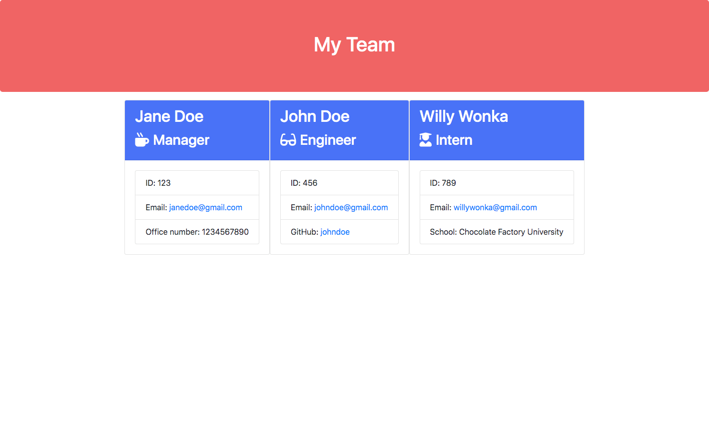
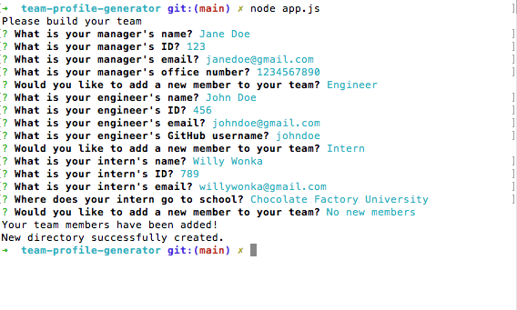

# Team Profile Generator

## Description
[Team Profile Generator](https://jeanarose.github.io/team-profile-generator) is a CLI designed to collect data about employees and generate a team profile based on the user's data. Team Profile Generator is useful for employees to gather helpful information about each team member, such as their name, ID, email, office number, GitHub username, and school. This application utilized several key technologies:
* `Inquirer` was used to ask the user which team member they wanted to add, followed by subsequent questions such as the team members name and email
* `Node.js` was used to interact with the command line
* `Jest` was used to run tests before the application was built to ensure best practices
* `Classes` and `subclasses` were used to create new employees 
* `Path` was used to create a file path that can be used to create the `output` directory
* `fs` was used to render the HTML and check to see if the `output` directory exists

View a video walk-through of the application here: https://github.com/jeanarose/team-profile-generator

## Team Profile Generator

<kbd><kbd>

## Table of Contents

- [Installation](#installation)
- [Usage](#usage)
- [Credits](#credits)
- [License](#license)
- [Tests](#tests)

## Installation
1. Go to the [GitHub repository for Team Profile Generator](https://github.com/jeanarose/team-profile-generator).
2. Click the green **Code** button.
3. Copy the SSH key.
4. In your terminal, go into the directory that you want to host Team Profile Generator.
5. Use the command `git clone [insert SSH key URL]` and click **Enter** (_Requires Git_).
6. Navigate to the Team Profile Generator directory and run `npm install` in the command line.
7. Type `node app.js` in the command line to run the app.

## Usage
Team Profile Manager can be used to add team members to the team page, which is useful for coworkers to gather helpful information for each team member. 

## Credits
The following people contributed to the success of this application. You can view their GitHub profiles by clicking on their names:
* [Jonathan Watson](https://github.com/jonathanjwatson)
* [Peter Colella](https://github.com/petercolella)

The following sites were used to find code to make Weather Dashboard function properly:
* [Atta:](https://attacomsian.com/blog/nodejs-check-if-directory-exists#:~:text=The%20simplest%20way%20to%20check,existsSync()%20method.&text=The%20existsSync()%20method%20returns,the%20path%20exists%2C%20false%20otherwise.) How to check if a directory exists in Node.js
* [Coder Rocket Fuel:](https://coderrocketfuel.com/article/create-a-new-directory-in-node-js) Create a new directory in Node.js
## License
Copyright (c) 2021 Jeana Rose Mathis

MIT License

Permission is hereby granted, free of charge, to any person obtaining a copy
of this software and associated documentation files (the "Software"), to deal
in the Software without restriction, including without limitation the rights
to use, copy, modify, merge, publish, distribute, sublicense, and/or sell
copies of the Software, and to permit persons to whom the Software is
furnished to do so, subject to the following conditions:

The above copyright notice and this permission notice shall be included in all
copies or substantial portions of the Software.

THE SOFTWARE IS PROVIDED "AS IS", WITHOUT WARRANTY OF ANY KIND, EXPRESS OR
IMPLIED, INCLUDING BUT NOT LIMITED TO THE WARRANTIES OF MERCHANTABILITY,
FITNESS FOR A PARTICULAR PURPOSE AND NONINFRINGEMENT. IN NO EVENT SHALL THE
AUTHORS OR COPYRIGHT HOLDERS BE LIABLE FOR ANY CLAIM, DAMAGES OR OTHER
LIABILITY, WHETHER IN AN ACTION OF CONTRACT, TORT OR OTHERWISE, ARISING FROM,
OUT OF OR IN CONNECTION WITH THE SOFTWARE OR THE USE OR OTHER DEALINGS IN THE
SOFTWARE.

## Tests
Interested in testing Team Profile Generator? 
Delete the output folder and run node app.js again. Check to see that an output folder was created.
---

© 2020 Trilogy Education Services, LLC, a 2U, Inc. brand. Confidential and Proprietary. All Rights Reserved.
